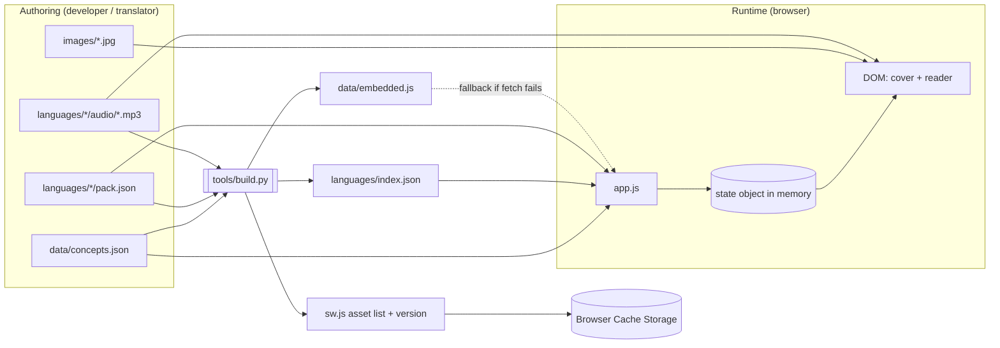
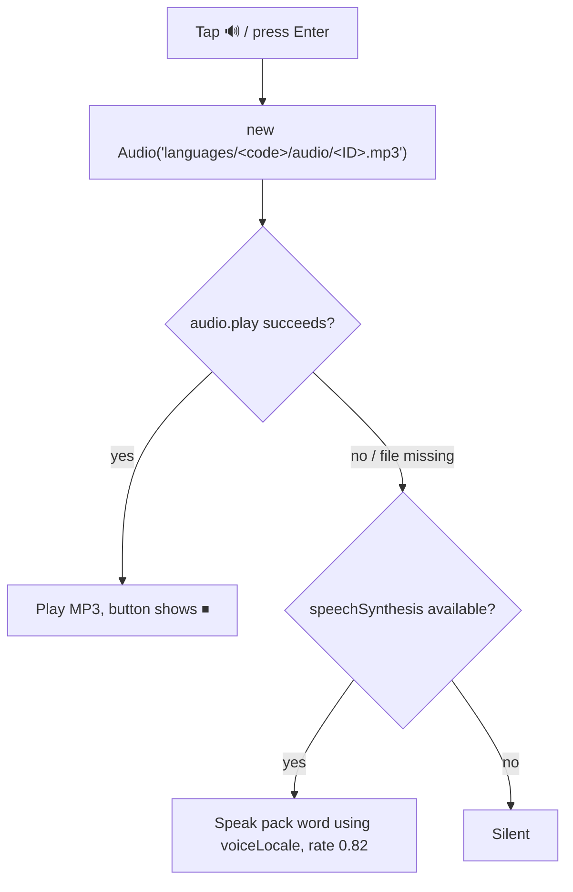

# My First Language Book — Developer Guide

Welcome to the team. This guide explains **what the app is, how it's put together, why it's built that way, and how to change it without breaking it.** Read sections 1–7 before making your first change; the rest is reference.

---

## Table of contents

1. [What the app does](#1-what-the-app-does)
2. [Design goals and why the tech is so simple](#2-design-goals-and-why-the-tech-is-so-simple)
3. [Running it locally](#3-running-it-locally)
4. [Project layout](#4-project-layout)
5. [The one big idea: the concept ID](#5-the-one-big-idea-the-concept-id)
6. [Data files reference](#6-data-files-reference)
7. [Data flow](#7-data-flow)
8. [Code walkthrough (`app.js`)](#8-code-walkthrough-appjs)
9. [Offline support: the service worker](#9-offline-support-the-service-worker)
10. [The build script (`tools/build.py`)](#10-the-build-script-toolsbuildpy)
11. [How to make common changes safely](#11-how-to-make-common-changes-safely)
12. [Rules that will break the app if ignored](#12-rules-that-will-break-the-app-if-ignored)
13. [Known gotchas and technical debt](#13-known-gotchas-and-technical-debt)
14. [Testing checklist](#14-testing-checklist)
15. [Troubleshooting](#15-troubleshooting)
16. [Deployment](#16-deployment)

---

## 1. What the app does

A picture book for young children that teaches vocabulary in **any language**. The child sees a large picture (a dog), the target-language word (*chien*), and can tap 🔊 to hear it spoken. They move through 200 pictures with arrows, swipes, or the keyboard.

Key properties:

- **Language-neutral pictures.** The same 200 images serve every language. Only the words and audio change.
- **Self-contained language packs.** One folder per language; copy a folder into another install and it works.
- **Installable and offline.** It's a Progressive Web App (PWA), so it can be added to a phone/tablet home screen and used without internet.
- **Child-facing.** The English word is shown only as a small "English hint" for the parent.

Currently shipped languages: French (`fr`, with recorded audio) and Spanish (`es`, words only; audio falls back to the browser's built-in voice).

---

## 2. Design goals and why the tech is so simple

There is **no framework, no bundler, no npm, and no server**. The app is plain HTML + CSS + JavaScript served as static files. This is deliberate:

| Decision | Reason |
|---|---|
| Vanilla JS, no framework | The UI is two screens. A framework would add build tooling and maintenance for no benefit. |
| Static files only | Can be hosted free on GitHub Pages, opened from a USB stick, or copied to any web server. |
| Data in JSON files, not code | Non-developers (parents, translators) can add words or languages without touching JavaScript. |
| Everything keyed by a 3-digit ID | Pictures, words and audio can be produced by different people and still line up (see §5). |
| Service worker + cache | Kids use tablets in cars, planes and waiting rooms; it must work offline. |
| One small Python script for "build" | A browser can't list folders, so *something* must record which language packs exist (see §10). Python was chosen because it needs no dependencies. |

If you're tempted to add a framework or a build system, please discuss with the team first. The simplicity is a feature.

---

## 3. Running it locally

**Quick look (double-click):** open `index.html` in a browser. Browsers block `fetch()` for local `file://` pages, so the app automatically uses the embedded copy of the data in `data/embedded.js` (see §7.3). Navigation and audio work; the service worker does **not** (it needs http/https).

**Proper testing (recommended):** serve the folder over HTTP so you exercise the same code path as production:

```bash
python3 -m http.server 8000
# then open http://localhost:8000
```

**Requirements for tooling:** Python 3.8+ (only for `tools/build.py`). Nothing else.

> When testing service-worker behavior, use DevTools → Application → Service Workers → "Update on reload" and "Clear site data" often. A stale service worker is the #1 cause of "my change isn't showing up".

---

## 4. Project layout

```text
My-First-Language-Book/
├── index.html                  The only page. Contains cover, reader and "For parents" modal.
├── app.js                      All application logic (~230 lines).
├── styles.css                  All styling.
├── sw.js                       Service worker (offline cache). Top block is GENERATED.
├── manifest.webmanifest        PWA metadata (name, colors, icon) for "Add to home screen".
│
├── data/
│   ├── concepts.json           The 200 concepts (ID, English name, category, emoji). SHARED by all languages.
│   ├── embedded.js             GENERATED. Copy of all data for file:// use. Never edit by hand.
│   └── vocabulary.json         LEGACY duplicate of concepts.json. Unused. Safe to delete (see §13).
│
├── images/
│   ├── 001.jpg … 010.jpg       One picture per concept ID (JPG or PNG). Only 001–010 exist so far.
│   └── cover_image.png         Cover art.
│
├── languages/
│   ├── index.json              GENERATED. List of pack folder names, e.g. ["fr","es"].
│   ├── fr/
│   │   ├── pack.json           French words + metadata.
│   │   └── audio/001.mp3 …     French recordings, one per ID.
│   └── es/
│       ├── pack.json           Spanish words + metadata.
│       └── audio/              (empty — falls back to browser voice)
│
├── icons/icon.svg              App icon.
├── tools/build.py              Validates packs and regenerates the GENERATED files.
│
├── README.md                   Short intro.
├── DATA_STRUCTURE.md           Short data-format reference.
├── 02. ADDING_IMAGES.md        Guide for artists adding pictures.
└── DEVELOPER_GUIDE.md          This file.
```

### Which files are generated?

| File | Generated by | Purpose |
|---|---|---|
| `languages/index.json` | `tools/build.py` | Tells the browser which packs exist |
| `data/embedded.js` | `tools/build.py` | Offline/`file://` fallback copy of the data |
| top block of `sw.js` (between `BUILD:START` / `BUILD:END`) | `tools/build.py` | Cache version + list of files to pre-cache |

Generated files **are committed to git**, because the site is hosted statically and there's no server-side build. Never edit them by hand; your changes will be overwritten next time someone runs the script.

---

## 5. The one big idea: the concept ID

Everything in the app is tied together by a **three-digit concept ID**: `001` to `200`.

```text
ID 003 means "dog":

  images/003.jpg                          ← the picture
  data/concepts.json  → {"id":"003", "concept":"dog"}    ← the English meaning
  languages/fr/pack.json → "003": {"word":"chien"}       ← the French word
  languages/fr/audio/003.mp3                              ← the French recording
  languages/es/pack.json → "003": {"word":"perro"}       ← the Spanish word
  languages/es/audio/003.mp3                              ← the Spanish recording
```

**Why:** the picture, the word, and the audio are created by different people at different times. A shared ID means nobody needs to coordinate filenames, and adding a language never touches images or code. The ID is the *only* link between these things, so **never renumber, reorder, or reuse an ID** (see §12).

The ID is also the **position in the book**: concept `001` is shown first, `200` last. IDs must be contiguous (`001, 002, …, 200`) and in order; the app checks this at startup.

---

## 6. Data files reference

### 6.1 `data/concepts.json`

An array, in book order:

```json
[
  { "id": "001", "category": "people", "concept": "baby", "visual": "👶" },
  { "id": "002", "category": "people", "concept": "mother", "visual": "👩" }
]
```

| Field | Used by the app? | Meaning |
|---|---|---|
| `id` | Yes | 3-digit, zero-padded string. Must equal its position (`001` at index 0, etc.). |
| `concept` | Yes | English name. Shown as the parent-facing "English hint" and as the image `alt` text. |
| `visual` | Yes (fallback) | Emoji shown **only if** no image file exists for this ID. Lets the book work while artwork is still being produced. |
| `category` | No (currently) | Reserved for future category browsing. Keep it filled in. |

### 6.2 `languages/<code>/pack.json`

```json
{
  "language": "fr",
  "name": "Français",
  "englishName": "French",
  "voiceLocale": "fr-FR",
  "sortOrder": 1,
  "translations": {
    "001": { "word": "bébé" },
    "002": { "word": "mère" }
  }
}
```

| Field | Required | Meaning |
|---|---|---|
| `language` | Yes | Short code. **Must exactly equal the folder name.** Used to build the audio path and saved in `localStorage`. |
| `name` | Yes | Name in its own language; shown in the dropdown and the cover ("English → Français"). |
| `englishName` | Yes | English name; used in button text ("Start the French book"). |
| `voiceLocale` | Yes | BCP-47 locale (`fr-FR`, `es-ES`, `de-DE`). Used by the browser voice when an MP3 is missing. |
| `sortOrder` | No | Lower = listed first. The **first** language is the default for new visitors. Default `100`. |
| `translations` | Yes | One entry per concept ID, each with a non-empty `word`. |

**Audio is not listed in the JSON.** It is found by convention: `languages/<language>/audio/<ID>.mp3`. This keeps packs small and means adding a recording never requires editing JSON.

### 6.3 Images

`images/<ID>.jpg` or `images/<ID>.png`. JPG is tried first, then PNG, then the emoji fallback. Full artist guidance is in `02. ADDING_IMAGES.md`.

---

## 7. Data flow

### 7.1 Big picture



### 7.2 Startup sequence (normal, over HTTP)

```mermaid
sequenceDiagram
  participant Browser
  participant app.js
  participant Server
  Browser->>app.js: index.html loads data/embedded.js then app.js
  app.js->>Server: GET data/concepts.json
  app.js->>Server: GET languages/index.json
  Server-->>app.js: ["fr","es"]
  app.js->>Server: GET languages/fr/pack.json, languages/es/pack.json
  app.js->>app.js: state.items = concepts, state.languages = packs
  app.js->>app.js: build <select> options from packs
  app.js->>app.js: pick language: localStorage("language") or first pack
  app.js->>app.js: validateData(concepts, pack)  (throws on any problem)
  app.js->>app.js: applyLanguageText() + render()
```



In words:

1. `index.html` loads `data/embedded.js` (defines `window.EMBEDDED_DATA`), then `app.js` (deferred).
2. `loadBook()` → `loadData()` fetches `concepts.json` and `languages/index.json`, then every pack listed there **in parallel**.
3. The language dropdown is built from the packs.
4. The saved language (`localStorage["language"]`) is used if present, otherwise the first pack.
5. `loadLanguage()` **validates** the data, stores it in `state`, updates all language-dependent text, and calls `render()`.

If anything throws, `showError()` puts a message on screen instead of failing silently. (Before that was added, a load failure left the app looking alive but unresponsive.)

### 7.3 The `file://` fallback

Browsers refuse `fetch()` on pages opened straight from disk. `loadData()` catches that failure and reads the same data from `window.EMBEDDED_DATA` (built into `data/embedded.js`). The shape is:

```js
window.EMBEDDED_DATA = {
  concepts: [ ... ],          // same as concepts.json
  order:    ["fr", "es"],     // same as languages/index.json
  packs:    { fr: {...}, es: {...} }   // same as each pack.json
};
```

Only **data** is embedded. Images and audio are still loaded by relative URL, which works fine on `file://`.

> **Consequence:** if you edit a JSON file and don't re-run `tools/build.py`, HTTP users see the new data but `file://` users see the old data.

### 7.4 Navigation

```text
click ‹ / ›   ┐
arrow keys    ├─►  go(delta)  ─►  state.index += delta  ─►  render()
Space         │      (ignored if it would go below 0 or past the last item)
swipe > 55px  ┘
```

`render()` reads `state.items[state.index]` and `state.translations[item.id]`, then updates the image, English hint, target word, progress bar/text, and enables/disables the arrows. It also calls `stopAudio()`, so audio never continues onto the next picture.

Swipes are detected with `pointerdown`/`pointerup` on the card; a swipe counts only if it is > 55px horizontally **and** clearly more horizontal than vertical (so scrolling doesn't turn pages).

### 7.5 Audio playback and fallback



- A missing MP3 (404) is **not** an error for the user; it silently falls back to the browser voice. This is how Spanish works today and how a brand-new language works before recordings exist.
- Playback starts from a user gesture (click/tap/Enter), which browsers require. Don't add auto-play on page load; it will be blocked.
- The button toggles: while speaking it shows ⏹ and tapping stops it.

### 7.6 Switching language

`<select>` change → `loadLanguage(code)` → re-validate → set `state.language` / `state.translations` → **reset `state.index` to 0** → save to `localStorage` → update text → `render()`.
Only the words/audio path change. `state.items` (concepts) is never reloaded.

### 7.7 State

All runtime state lives in one object at the top of `app.js`:

| Field | Meaning |
|---|---|
| `items` | Concept array from `concepts.json` |
| `languages` | Array of loaded packs |
| `language` | Currently selected pack |
| `translations` | Shortcut to `language.translations` |
| `index` | Position in the book (0-based) |
| `startX`, `startY` | Swipe start coordinates |
| `audio` | Current `Audio` object, if playing |

The only thing persisted between visits is the chosen language (`localStorage` key `language`). **Reading position is intentionally not saved.**

---

## 8. Code walkthrough (`app.js`)

| Function | What it does | Notes |
|---|---|---|
| `loadJSON(path)` | `fetch` + throw if not OK | Throws with the failing path in the message. |
| `loadData()` | Loads concepts + index + all packs; falls back to `EMBEDDED_DATA` | The single place that knows about the `file://` fallback. |
| `audioPath(code, id)` | Returns `languages/<code>/audio/<id>.mp3` | **The only place the audio path convention lives.** Change it here if the layout ever changes. |
| `loadLanguage(code)` | Validates, sets state, saves choice, updates UI | Unknown code falls back to the first pack. |
| `applyLanguageText()` | Updates title, cover text, button and hint labels | If you add new language-dependent text in `index.html`, update it here. |
| `loadBook()` | Startup orchestration; builds the dropdown | Called once. |
| `showError(error)` | Shows ⚠️ and the message on screen | Used by startup and language switching. |
| `validateData(items, language)` | Fails fast on bad data | See §12. |
| `render()` | Draws the current picture/word/progress | Also stops audio. Image falls back JPG → PNG → emoji. |
| `showReader()` / `go(delta)` | Show the reader; move ±1 | `go` clamps to range. |
| `stopAudio()` | Stops MP3 and browser speech, resets the button | Called on every render. |
| `playAudio()` | Plays MP3, falls back to speech | See §7.5. |

Below the functions are the event listeners (buttons, keyboard, swipe) and service-worker registration.

**Keyboard:** `←`/`→` navigate, `Space` = next, `Enter` = play audio, `Esc` = back to cover.

**Design choice — validate at load:** `validateData` throws on the first problem (missing word, wrong ID order, etc.). This is intentional: a child should never reach a page with a blank word or wrong picture. A loud failure during development is better than a subtle one in the living room. `tools/build.py` performs a similar check earlier, at build time.

---

## 9. Offline support: the service worker

`sw.js` has two halves:

1. **Generated block** (top, between `// BUILD:START` and `// BUILD:END`): `CACHE` (a version name like `language-book-2a567b07`) and `ASSETS` (every file to pre-cache). Do not edit.
2. **Hand-written logic** (below): install, activate, fetch handlers.

**Lifecycle**

- **install:** pre-caches everything in `ASSETS` (`cache.addAll`). `skipWaiting()` lets the new version take over quickly.
- **activate:** deletes any cache whose name isn't the current `CACHE`. This is how old versions are cleaned up.
- **fetch:** two strategies:

| Request type | Strategy | Why |
|---|---|---|
| Code and data (`.html`, `.js`, `.json`, `.css`, …) | **Network first**, fall back to cache when offline | Developers and users always get the latest version when online; can't get stuck on an old `app.js`. |
| Media (`.mp3`, `.jpg`, `.png`, `.svg`) | **Cache first**, fall back to network | Big files that rarely change; instant loading and reliable offline playback. |

> **History:** the first version was cache-first for everything. That meant a broken `app.js` could be served from the cache forever, even after the fix was published. Network-first for code was added to prevent this class of bug.

**Two important behaviors**

- **`cache.addAll` is all-or-nothing.** If *any* file in `ASSETS` returns 404, the service worker fails to install and the app silently loses offline support. That's why `ASSETS` is generated from files that actually exist. If you delete a file, re-run `tools/build.py`.
- **The cache version changes only when the build script sees a change** (see §10, §13). A new version → a new cache name → old cache deleted on activate.

Service workers only run on **https** or **localhost**, never `file://`.

---

## 10. The build script (`tools/build.py`)

```bash
python3 tools/build.py
```

**Why it exists:** a browser cannot list the contents of a folder. To know which language packs exist, the app reads `languages/index.json`. The script creates that file by scanning `languages/*/pack.json`, so nobody maintains the list by hand.

**What it does**

1. Loads `data/concepts.json`.
2. For every `languages/<code>/pack.json`, **validates**:
   - valid JSON
   - `language` equals the folder name
   - `name`, `englishName`, `voiceLocale` present
   - a non-empty `word` for every concept ID
   - no unknown IDs
3. Prints a coverage report, e.g. `fr Français words 200/200 audio 200/200`.
4. **Exits with an error (and writes nothing)** if anything is wrong.
5. Writes `languages/index.json`, `data/embedded.js`, and the generated block of `sw.js` (including a new cache version).

**Run it whenever you:** add/remove/edit a language pack, edit `concepts.json`, add/remove an image or audio file, or change `app.js`/`index.html`/`styles.css` and want installed copies to refresh.

Commit the regenerated files together with your change.

---

## 11. How to make common changes safely

### 11.1 Add a new language

1. Copy an existing pack folder, e.g. `languages/es/` → `languages/de/`.
2. In `languages/de/pack.json` change `language` (`de`), `name` (`Deutsch`), `englishName` (`German`), `voiceLocale` (`de-DE`), and translate all 200 `word` values.
3. (Optional) put recordings in `languages/de/audio/001.mp3 … 200.mp3`. Delete the placeholder text file.
4. `python3 tools/build.py` — fix anything it reports.
5. Serve locally, hard-refresh, pick the language, step through several pictures and press 🔊.

**Moving a pack to another install of the app:** copy the folder into that install's `languages/` and run its `tools/build.py`. Both installs must have the same `concepts.json` order (§5).

### 11.2 Change a word or fix a translation

Edit the `word` in `languages/<code>/pack.json`, then run `tools/build.py` (to refresh `embedded.js` and the cache version). If the recording says the old word, replace the MP3 too (see the audio caveat in §13).

### 11.3 Add or replace a recording

Save as `languages/<code>/audio/<ID>.mp3` (three-digit ID, lowercase `.mp3`). Run `tools/build.py` so it's pre-cached. **Replacing an existing file with the same name has a caching caveat — see §13.**

### 11.4 Add or replace a picture

Save as `images/<ID>.jpg` or `.png`. Same caching caveat when replacing. Use clear, high-resolution images with the subject large. See `02. ADDING_IMAGES.md`.

### 11.5 Add more concepts (201, 202, …)

> **Full, tested step-by-step guide: `02c. ADDING_CONCEPTS_AND_CATEGORIES.md`** (covers categories/topics, quiz and spelling considerations, special letters, and common mistakes). The short version follows.

Every layer must be updated together, or the app will refuse to start:

1. Append to `data/concepts.json` with the next ID (`"201"`), an English `concept`, a `category`, and an emoji `visual`.
2. Add `"201": {"word": "..."}` to **every** `languages/*/pack.json`.
3. Add `images/201.jpg` (optional; emoji shows until it exists).
4. Add `audio/201.mp3` in each pack (optional).
5. `python3 tools/build.py`.

The build script will fail loudly if any pack is missing the new word, which is the point.

### 11.6 Change UI text or styling

- Text that depends on the language must be set in `applyLanguageText()` (give the element an `id` in `index.html`).
- Styling is all in `styles.css`; colors are CSS variables at the top (`--paper`, `--accent`, …).
- After changing `app.js`, `index.html` or `styles.css`, run `tools/build.py` so the cache version changes.

### 11.7 Change how audio or image paths work

Audio: only `audioPath()` in `app.js`. Images: the `imageSources` array in `render()`. Also update `tools/build.py` (its asset lists and audio counting) and `DATA_STRUCTURE.md`.

---

## 12. Rules that will break the app if ignored

The app validates these at startup and shows an error if broken. Know them so you don't trip them.

1. **IDs are 3-digit, zero-padded strings** (`"007"`, not `7` or `"7"`).
2. **IDs must run `001…N` contiguously, in array order, with no duplicates.**
3. **Never renumber, reorder, insert in the middle, or reuse an ID.** All pictures, words and recordings in every language are matched by ID. Reordering `concepts.json` silently pairs the wrong pictures with the wrong words in every pack. *To add a concept, always append.*
4. **Every pack must contain a non-empty `word` for every concept ID.** One missing word blocks that language.
5. **`pack.json` → `language` must equal the folder name.** Otherwise audio paths point at a folder that doesn't exist.
6. **Concepts 001–010 are locked.** `validateData()` in `app.js` contains a hard-coded `photoMap` that asserts `001=baby, 002=mother, 003=dog, 004=banana, 005=cup, 006=ball, 007=car, 008=tree, 009=eat, 010=sleep` because those ten real photographs exist. If you change any of those concepts, the app refuses to start. Update `photoMap` at the same time (or remove the check once all artwork is final — see §13).
7. **Never hand-edit generated files** (`languages/index.json`, `data/embedded.js`, the top of `sw.js`).
8. **Run `python3 tools/build.py` before committing** any change to data, packs, or media.
9. **Don't autoplay audio.** Browsers block it; playback must start from a user action.
10. **File names are lowercase, three-digit, with extensions `.jpg`/`.png`/`.mp3`.** Web servers like GitHub Pages are case-sensitive: `003.MP3` will 404 even if it works on your Windows/Mac machine.

---

## 13. Known gotchas and technical debt

Be aware of these; some are good first tasks.

| # | Issue | Impact | Suggested fix |
|---|---|---|---|
| 1 | **Replacing a media file under the same name doesn't propagate to installed copies.** Media is cache-first, and the cache version hash is built from the *list* of files and the code, not the media bytes. | A fixed `003.jpg` or re-recorded `003.mp3` keeps showing the old one on devices that already cached it. | Include media file sizes/hashes in the version calculation in `build.py`, or temporarily bump the version by editing any code file. Test by clearing site data. |
| 2 | **`data/vocabulary.json` is a legacy, unused duplicate** of `concepts.json` (byte-identical when inspected). Old docs referred to it. | Confusing; someone may edit it and see no effect. | Delete it. Nothing references it. |
| 3 | **Hard-coded `photoMap` in `validateData()`** ties the app to the first ten concepts. | Blocks legitimate content changes to 001–010. | Remove it or move the expectation into a test once artwork is final. |
| 4 | **`data/embedded.js` duplicates all data.** | Forgetting to rebuild makes `file://` show stale data. | Keep running `build.py`; consider a git pre-commit hook or CI step. |
| 5 | **Generated files are committed.** | Merge conflicts in `sw.js`/`embedded.js` are possible. | On conflict, resolve the source files, then simply re-run `build.py` and commit its output. |
| 6 | **`alt="${item.concept}"` is inserted via `innerHTML`.** | A concept containing `"` or `<` would break the markup. Currently all values are safe. | Create the `` with `createElement` and set `alt` as a property. |
| 7 | **No automated tests.** | Regressions are caught only by manual testing (§14). | Add a small script that runs `validateData` and the build validation in CI. |
| 8 | **No right-to-left (RTL) support.** | Arabic/Hebrew would lay out incorrectly. | Set `dir` from a `direction` field in `pack.json` and audit the CSS. |
| 9 | **Some target languages have no browser voice** on some devices. | Missing MP3 + no voice = silent button. | Prefer shipping recordings for such languages. |
| 10 | **Progress is not saved** and `category` is unused. | Child restarts at picture 1; no category browsing. | Product decisions; see README "Planned improvements". |
| 11 | `images/The List`, `icons/The List` and `01. Link to Visit Site` are stray notes/placeholders, not used by the app. | None. | Safe to tidy up, but check with the team first. |
| 12 | Pack content quirks: `056 fish food` and `085 chicken` (animal) vs `057 chicken` (food) are ambiguous concepts; `026 grandparent` and `016 child` have no single natural word in some languages. | Translators must choose; French uses *poulet* for both chickens. | Clarify concept names in `concepts.json` when convenient (this needs a coordinated update of all packs). |

---

## 14. Testing checklist

Run this before merging any change. Use a served copy (`python3 -m http.server`) **and** a double-clicked `index.html`.

**Startup**
- [ ] Cover loads with the cover image, correct count ("200 pictures…") and the language dropdown lists every pack.
- [ ] Browser console shows no red errors.

**Navigation**
- [ ] "Start" shows picture 1 (`1 / 200`, *bébé* in French).
- [ ] `›` and `‹` move forward/back; `‹` is dimmed on the first picture and `›` on the last.
- [ ] Arrow keys, Space, and swipe work; vertical scrolling doesn't change the picture.
- [ ] Progress bar and "n / 200" update.

**Audio**
- [ ] 🔊 plays the MP3 for a language that has recordings (French).
- [ ] 🔊 speaks via the browser voice for a language without recordings (Spanish).
- [ ] Tapping while playing stops it; moving to the next picture stops it.

**Languages**
- [ ] Switching language on the cover updates the word list, the start button text ("Start the Spanish book") and the subtitle.
- [ ] The choice is remembered after refresh.

**Images**
- [ ] Pictures 001–010 show photos; 011+ show emoji placeholders (or your new images).

**Offline (HTTP/HTTPS only)**
- [ ] After one visit, DevTools → Network → "Offline" → reload: cover, navigation, French audio and pictures still work.

**Build**
- [ ] `python3 tools/build.py` finishes with `OK` and reports the expected coverage.
- [ ] `git status` shows the regenerated files included in your commit.

---

## 15. Troubleshooting

| Symptom | Likely cause | Fix |
|---|---|---|
| Can't go to the next picture; 🔊 does nothing | Data failed to load (`items` empty). Historically caused by opening via `file://` with no embedded fallback. | Check console and the on-screen ⚠️ message. Make sure `data/embedded.js` exists and is loaded before `app.js`; re-run `build.py`. |
| Screen shows ⚠️ with "Missing … word for 0xx" | A pack lacks a translation for that ID. | Add the word; run `build.py` (it reports the same problem earlier). |
| ⚠️ "Concept IDs must run 001..N" | `concepts.json` was reordered, an ID skipped, or an ID is not 3-digit. | Fix IDs; restore order. |
| ⚠️ "Picture 00x is not mapped to …" | A concept in 001–010 was changed. | See rule 6 in §12. |
| New language doesn't appear | Forgot `build.py`, or `pack.json` `language` ≠ folder name, or stale cache. | Run `build.py`; hard refresh; clear site data. |
| My change isn't showing on the live site | Old service worker/cache, or GitHub Pages still deploying. | Wait for deploy, hard refresh, DevTools → Application → Clear site data. Verify `sw.js` cache version changed. |
| Audio works locally but 404s on GitHub Pages | File name case or wrong folder (`003.MP3`, `Audio/`). | Use exact lowercase `languages/<code>/audio/<ID>.mp3`. |
| Audio silent on a phone | Device has no voice for `voiceLocale` and no MP3, or silent switch on (iOS). | Add MP3s; check device volume/silent mode. |
| Offline mode doesn't work | Not on HTTPS/localhost, or service worker install failed (a missing file in `ASSETS`). | Check DevTools → Application → Service Workers; re-run `build.py` so `ASSETS` matches real files. |
| Build script says "Problems found" | Pack validation failed. | Read the listed problem; nothing was written, so fix and re-run. |
| Old picture/recording still showing after replacement | Media cache-first, same filename (see §13 #1). | Clear site data; long-term, implement the suggested fix. |

---

## 16. Deployment

The live site is hosted on **GitHub Pages** (static hosting over HTTPS, which service workers require).

1. Make your change on a branch.
2. Run `python3 tools/build.py` and confirm `OK`.
3. Run through the testing checklist (§14).
4. Commit source **and** regenerated files (`languages/index.json`, `data/embedded.js`, `sw.js`).
5. Merge to the publishing branch; Pages deploys automatically (usually within a minute or two).
6. Verify on the live URL in a private window, then once in a normal window that has visited before (this exercises the service-worker update path).

The manifest uses relative paths (`start_url: "./"`), so the app works from a repository sub-path (`https://<user>.github.io/<repo>/`) or a domain root without changes. Always use **relative** URLs in new code for the same reason; a leading `/` would break the sub-path deployment.

---

### Glossary

- **Concept** – one thing that can be pictured (dog, run, happy). Identified by a 3-digit ID.
- **Language pack** – a folder in `languages/` with words (and optionally audio) for one language.
- **PWA** – Progressive Web App; a website that can be installed and used offline.
- **Service worker** – a script the browser runs in the background to manage caching and offline behavior.
- **Fallback voice** – the browser's built-in text-to-speech, used when there is no MP3.
- **Generated file** – a file produced by `tools/build.py`; never edited by hand.

## Quiz and Spelling modes

- `games.js` – shared helpers (round runner, results, review, accent folding, sound detection).
- `quiz.js` – 10-question quiz (picture→word, word→picture, listen→picture when audio/voice exists).
- `spelling.js` – "Complete the word" (blanks) and "Fix the word" (unscramble). Phrases use one focus word (3+ letters).
- No data changes are needed: both modes read `data/concepts.json` and the active language pack, so new languages work automatically.
- Accents: a typed letter that only differs by accent (é/e, ɛ/e, ɔ/o, ŋ/n) is accepted, with a "Remember the accent" note. Edit `SPECIAL` in `games.js` to add more folds.
- After adding/renaming files run `python3 tools/build.py` to refresh the offline cache list.
